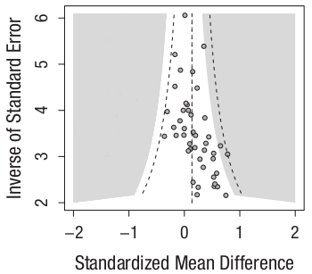
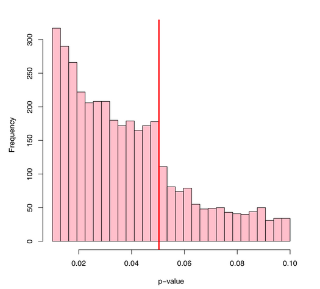
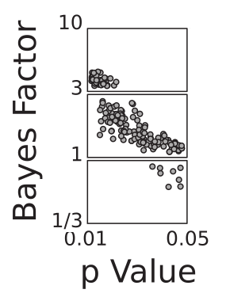

```{r init,include=FALSE}
knitr::opts_chunk$set(echo = TRUE, comment=NA)
library(tidyverse)
cpsdata <- read_csv("cps2.csv")
cpslow <- cpsdata %>% filter(income < 150000)
```

## The replication crisis

|                                               | P < .05 |
|-----------------------------------------------|---------|
| **OVERALL**                                   | 36%     |
| J. Personality and Social Psych.              | 23%     |
| J. Experimental Psychology: Learn. Mem. Cog.  | 48%     |
| Psychological Science (social)                | 29%     |
| Psychological Science (cognitive)             | 53%     |

- Open Science Collaboration (2015). Estimating the reproducibility of psychology science. _Science, 349,_ aac4716.

## Seven causes of the Replication Crisis

1. Publication bias

2. Small sample size

3. Misunderstanding statistics

4. Low reproducibility

5. 'p' hacking

6. Poor project management

7. Publication norms

## 1. Publication bias



-- Cognitive bias modification: Hallion & Ruscio (2011).

## 'Significant' results are easier to publish

- Traditional statistics (e.g. t-tests): 

	-- null results (P > .05) are meaningless.

- Bayesian statistics (e.g. Bayesian t-test): 

	-- null results (BF < 1/3) are informative.

- Bayes Factor (BF): 

	-- BF < 1: Evidence for the null

	-- BF > 1: Evidence for the alternative
	
	-- Further from 1: better evidence.

	-- Convention: BF < 1/3 and BF > 3
	
## Bayes Factors

A Bayes Factor is how much you should update your belief:

### Example 1:

1. Initial belief ("prior"): null & alternative equally likely
	
2. Data collected: BF = 3
	
3. Updated belief ("posterior"): alternative 3x as likely as the null.

### Example 2:

1. Prior belief: null 1000x more likely (e.g. ESP?)
	
2. Data collected: BF = 10
	
3. Posterior belief: null 100x more likely

## Easy Bayes Factor calculation in R

Testing for a gender difference in annual salary:

```{r bayesfactor, message=FALSE}
library(BayesFactor)
ttestBF(formula = income ~ sex,
        data = data.frame(cpsdata))
```

## 2. Small sample size

- Mostly, we do not collect enough data.

	-- Median total sample size: 40 participants (Marsalek et al., 2011)
	
	-- Median effect size: d = 0.5 (Bakker et al., 2012)
	
	-- Typical power of an independent-samples test under these conditions:  **.35**
	
	-- Power generally considered a minimal quality standard: **.80**
	
	-- On average, we need to collect about three times as much data as we think we do (Bakker et al., 2016). 

- Interacts badly with publication bias:

	-- Most small-sample _published_ studies overestimate effect size.
	
	-- So median effect size is an over-estimate!

## Easy power calculations in R

```{r pwr}
library(pwr)
pwr.t.test(power = .8, d = .5, sig.level = .05,
           type = 'two.sample')
```

## A question

You anticipate a small effect (d = 0.2), so you run an experiment with 500 participants to ensure adequate power. You get a p value between .04 and .05. Which is more likely:

a.  the null hypothesis (i.e. that there is no difference)

b.  the experimental hypothesis (i.e. that there is a difference)

## The answer

You anticipate a small effect (d = 0.2), so you run an experiment with 500 participants to ensure adequate power. You get a p value between .04 and .05. Which is more likely:

**the null hypothesis (i.e. that there is no difference)**

-- Rouder & Morey (2011)

## P values are freakin' weird!

- Not-weird stuff:

	-- If the experimental hypothesis is correct, lower p values *are* more likely than high ones.

	-- And this is affected by sample size in the way you'd expect. If H1 is correct, as sample size increases, lower p values are more likely.

- **BUT:**

	-- If the null is correct, *all p values between 0 and 1 are equally likely* !

	-- And this is _not_ affected by the sample size. _At all_.

- SO:

	-- With small effect size, and large N, .04 < p <.05 is more likely under the null than under the experimental hypothesis!

## The game of optimizing: .04 < P < 0.5



-- Masicampo & Lalande (2012). 

<!--
[source of graphic](https://normaldeviate.wordpress.com/2012/08/16/p-values-gone-wild-and-multiscale-madness/)
-->

## Weak evidence: .04 < P < .05



-- Wetzels et al. (2011). 

## 3. Misunderstanding statistics

- No one understands p values!

- A strange prevalence of p values just below .05

- Such p values provide only  weak evidence 

	-- BF < 3 in 70% of cases.

-  **Use Bayes Factors instead**

## 4. Low reproducibility

- If you ran a different experiment, and analysed the data differently, is it that surprising you got a different answer?

	-- How do you know you ran the same experiment?

	-- How do you know you did the same analyses?

- I have requested raw data several times. 

	-- On the minority of occasions where I actually got it, I normally could not replicate the analyses in the paper. 
	
	-- Colleagues have had similar experiences.

## Data and code publication

- On acceptance of your manuscript, publish:

	1. Trial-level data
	
	2. Analysis script: from data to paper
	
	3. Stimuli 
	
	4. Experiment code
	
- Best practice:

	1. Use a third-party free repository: zenodo.org, osf.io

	2. Include a _code book_.

	3. Use open _formats_: e.g. CSV, not Excel / SAV

	4. Use open **platforms**: e.g. R, PsychoPy, not SPSS, E-prime.
	
	5. Use free, copyleft, licenses (e.g. CC-BY-SA, GPL, not (c) APA )

## 5. 'p' hacking

**A study conducted with real participants, employing legitmate methods, reported truthfully**:

We asked 20 University of Pennsylvania undergraduates to listen to either "When I'm Sixty-Four" by The Beatles or "Kalimba". Then, in an ostensibly unrelated task, they indicated their birth date (mm/dd/yyyy) and their father's age. We used father's age to control for variation in baseline age across participants.

An ANCOVA revealed the predicted effect: According to their birth dates, people were nearly a year-and-a-half younger after listening to "When I'm Sixty-Four" (adjusted M = 20.1 years) rather than "Kalimba" (adjusted M = 21.5 years), F(1, 17) = 4.92, p = .04.

-- Simmons et al. (2011).

## Forest of analysis

- Common analysis practices:

	-- Reporting a subset of the dependent variables collected.

	-- Reporting a subset of the experimental conditions run.

	-- Testing significance after every 10 subjects, stopping when significant.

	-- Use of covariates.

- False positive rate if you do all of these? About **60%** !

## Richard Feynman

"The first principle is that you must not fool yourself -- and you are the easiest person to fool.  So you have to be very careful about that.  After you've not fooled yourself, it's easy not to fool other scientists. You just have to be honest in a conventional way after that."

- Feynman (1974)

## Avoiding fooling yourself (and others)

1. Get your procedure just right with pilot work.

2. When it's optimized, briefly write down:

	-- Your hypotheses
	
	-- Your design (IV and DV)
	
	-- Your intended sample size (motivated by power calculation)
	
	-- Your analysis plan

3. Consider getting it notarized by e.g. aspredicted.org or osf.io

4. Now follow your plan.
 
## 6. Poor project management

- How many experiments have I run on this topic in my career? 

	-- How many of them worked? 
	
	-- How did they differ?

- Which version of this file is:

	-- the experiment I actually ran? (rather than e.g. the pilot)
	
	-- The complete data set? 
	
	-- The analysis reviewers want me to re-do?

## Poor project management

- This experiment / analysis  was done by a:

	-- project student 
	
	-- PhD student
	
	-- post-doc 
	
	-- colleague. 
	
- and **PANIC**: 

	-- I don't have the files, and they've left! 
	
	-- Or, I do have the files and I can't make sense of them.

## Version control systems

- Like a shared folder but better.

- You don't change filenames:

	`analysis_final_final_really_final_honest_new.R` 
	
- You just save new versions to the same name. 

- Previous versions are kept, time stamped. with a message. 

- You can always go back.

- You have a perfect audit trail. 

- You can *branch* and *merge*. 

- You can easily do _code review_. 

## Version control systems

- Pick a VCS based on _git_ or _svn_

	-- RStudio works well with either.

- Many free third-party solutions are available:

	-- github.com (integrates with zenodo, OSF)
	
	-- gitlab.com
	
- Don't put sensitive or confidential information on these 'cloud' systems:

	-- Anonymize data before upload, **AND**
	
	-- Never store de-anonymizing information, **AND**
	
	-- Make private to your team (unless you want it public, e.g. publication)

- Plymouth OneDrive is a cloud system. 

## Version control systems

- The DAU (Data and Analysis Unit) concept:

	-- Give each experiment a unique identifier (e.g. _wills179_)

	-- Have a different repository for each experiment. 

	-- Keep the analysis with the experiment.

- Dramatic improvements in efficiency. Ocean Health Index:

	-- Before VCS: 30 people, 3 years
	
	-- After VCS: 1 person, 3 months
	
	-- https://red.ht/2zXVZ81 


## 7. Publication norms

- Substantial pressure on _number_ of publications:

	-- Junior post-doc job: "Successful applicants typically have 4 first-author  publications" (1998)

	-- "A professor should have at least 50 journal articles" (2012)

	-- PDR: "This year, I will submit two 3* papers" (2017)

	-- Speaker introduction: "Prof. Esteem has published over 200 papers" (2017)

- Probably increases non-replication rate. 


## Quality over quantity

- REF2021: Perfect output score if we all published one 4* paper every three years, _and nothing else_

- Increases quality of peer review (can spend more time per paper)

- Reduces time spent:

	-- Formatting papers
	
	-- Arguing with reviewers
	
- Reduces money spent on publishing:

	-- approx. £1500  per article open access.
	
	-- approx. £4000 per article by library subscription.

## Conlict of interests

- Publishing fewer, better, papers is good for pretty much everyone, _except those who want to get a job or get promoted_.

- Promotion often considers h-index:

	-- h = 8: 40th percentile for a Prof, 80th percentile for an AP. (Ruscio & Prajapati, 2013) 

- Publishing one 4* paper every 3 years, and nothing else:

	-- 22+ years to reach h = 8
	
	-- 150 years to reach 50 papers


## Addressing profilic-publication pressure

- Focus promotion and staff hires on output _quality_.

- Base PDR around 5-year research plans.

- Consider how you express esteem publicly.

## Seven things you can start doing today

1. Start doing power calculations

2. Start using Bayes Factors.

3. Start using open platforms: R, Python

4. Start using version control: github.com

5. Preregister your next big study: aspredicted.org

6. Publish your data and analysis scripts: Zenodo / OSF

7. Promote quality over quantity in publication

## Conclusion

If the Replication Crisis leads us to doing more open, reproducible, science, it'll be one of the best things that ever happened in psychology.

## Licence

_All materials for this presentation (slides, and video and audio recordings of me presenting it today) are licensed under a Creative Commons Attribution Share-Alike licence_  CC-BY-SA 4.0, with the following exceptions:

- The images on slides 4 and 14, and the text on slide 18, are adapted from restrictively licensed journal articles. Consider replacing with materials with a free licence.

- The image on slide 13 is assumed to be in the public domain.


## References (1 of 2)

-- Bakker, M., van Dijk, A., & Wicherts, J.M. (2012). The rules of the game called psychological science. _Perspectives on Psychological Science, 7,_ 543-554.

-- Bakker, M., Hartgernik, C.H.J., Wicherts, J.M. & can der Maas, H.L.J. (2016). Researchers' intuitions about power in psychological research, _Psychological Science, 27,_ 1069-1077.

-- Feynman, R.P. (1974). Cargo cult science. _Engineering and Science, 37,_ 10-13. 

-- Hallion, L. S., & Ruscio, A. M. (2011). A meta-analysis of the effect
of cognitive bias modification on anxiety and depression. _Psychological Bulletin, 137,_ 940–958.

-- Masicampo, E.J. and Lalande, D. (2012). A peculiar prevalence of p values just below .05. _Quarterly Journal of Experimental Psychology, 65,_ 2271-2279.

## References (2 of 2)

-- Open Science Collaboration (2015). Estimating the reproducibility of psychology science. _Science, 349,_ aac4716.

-- Rouder, J.N. & Morey, R.D. (2011). A Bayes factor meta-analysis of Bem's ESP claim. _Psychonomic Bulletin & Review, 18_, 682-689.

-- Ruscio, J. & Prajapati, B. (2013). Citation-based indices of scholarly impact: Databases and norms. _APS Observer, 26,_ 7. 

-- Simmons, J.P., Nelson, L.D. & Simonsohn, U. (2011). False-positive psychology: Undisclosed flexibility in data collection and analysis allows presenting anything as significant. _Psychological Science, 22,_ 1359-1366.

-- Wetzels, R., Maztke, D., Lee, M.D., Rouder, J.N., Iverson, G.J. & Wagenmakers, E-J. (2011). Statistical evidence in experimental psychology: An empirical comparison using 855 t-tests. _Perspectives on Psychological Science, 6,_ 291-298.

